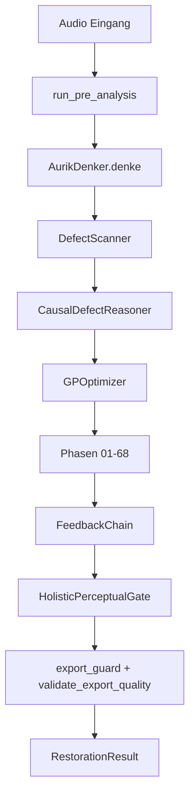

# Aurik 10.0.0 — Architektur-Überblick

**Stand:** Juli 2026
**Version:** 10.0.8
**Status:** RELEASE_MUST-konform | §v10 Pleasantness-First aktiv

Verbindlicher Wahrheitsstand: `.github/specs/01-14` und `CLAUDE.md`.

## Kernprinzip (§v10)

**Aurik optimiert JEDEN individuellen Song autonom.** Kein blinder Material-Glaube,
keine statischen Schwellwerte ohne Messung. Die Tonträgerkette, das gemessene SNR,
das tatsächliche Spektrum und die harmonische Dichte des Songs bestimmen ALLE
Parameter — nicht der erkannte Materialtyp allein.

## Kernzahlen (aktuell)

- 68 Phasen (Phase 01–66 + Vocal Repair + Glue Stage)
- 62 DetectionTypes (DefectScanner) — ALLE SNR-adaptiv
- 62 Kausal-Ursachen (CausalDefectReasoner) — CAUSE_PARAMS SNR-skaliert
- 14 Musical Goals (Pleasantness-First)
- ~18.400 Tests (511 mit Markern)
- 3 neue Messfunktionen: `_estimate_local_snr()`, `_measure_spectral_deviation()`, `_measure_harmonic_density()`

## Kanonischer Release-Vertrag

```text
Audio-Import  -> backend.api.bridge.get_load_audio_fn()
Voranalyse    -> backend.api.bridge.run_pre_analysis() genau einmal
Pipeline      -> get_aurik_denker_instance().denke(...)
Modus         -> restoration | studio2026
Export        -> export_guard() + validate_export_quality() + AudioExporter
```

## Zentrale Komponenten

| Komponente | Zweck |
| --- | --- |
| `AurikDenker` | Kognitive Orchestrierung der Gesamtpipeline |
| `UnifiedRestorerV3` | Phase-Orchestrierung und Kontextsteuerung |
| `DefectScanner` | Defekt-Detektion (62 Typen) |
| `CausalDefectReasoner` | Kausalkette und Mapping auf Phasen (62 Ursachen) |
| `GPOptimizer` | Adaptive Staerke-/Parameteroptimierung |
| `MusicalGoalsChecker` | 14-goal Bewertung |
| `HolisticPerceptualGate` | HPI/AFG/VQI-basierte Freigabelogik |

## Datenfluss (vereinfacht)



## Qualitäts- und Sicherheitsinvarianten

- `artifact_freedom < 0.95` blockiert Freigabe.
- Vokalpfad nutzt VQI als zusaetzlichen Recovery-Trigger.
- Kein paralleler Produktpfad ausserhalb des kanonischen Vertrags.

## Produktgrenzen

- Desktop-only
- Offline-first
- Mono/Stereo als produktiver Zielpfad
- Keine Cloud-/Serverpflicht im Endnutzerbetrieb
